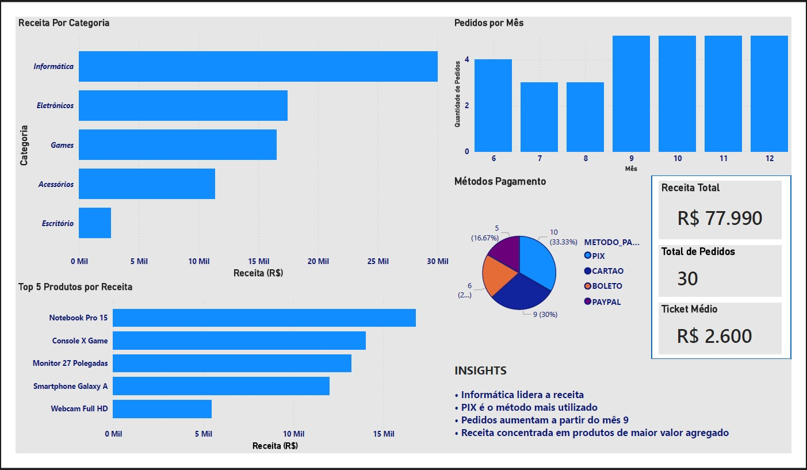

# 📊 E-commerce Sales Analysis

## 📌 Objetivo

Analisar o desempenho de vendas de um e-commerce, identificando padrões de receita, comportamento de pedidos e distribuição por categorias e métodos de pagamento, com foco na geração de insights para suporte à tomada de decisão.

---

## 🧠 Contexto

Este projeto simula um ambiente de análise de dados de um e-commerce, com o objetivo de responder perguntas de negócio relacionadas ao desempenho comercial, comportamento de vendas e distribuição de receita.

---

## 🛠️ Tecnologias Utilizadas

* SQL (consultas e agregações)
* Banco de dados relacional Oracle
* Power BI (visualização de dados)
* Git e GitHub (versionamento)

---

## ⚙️ Processo de Análise

1. Organização dos dados de vendas
2. Criação de consultas SQL para cálculo de métricas
3. Extração dos dados agregados
4. Importação dos dados no Power BI
5. Construção do dashboard
6. Análise dos resultados e geração de insights

---

## 📊 Dashboard

O dashboard foi desenvolvido no Power BI com foco em indicadores-chave de performance (KPIs) e visualização clara dos dados.

### Principais métricas:

* Receita total
* Total de pedidos
* Ticket médio

### Visualizações:

* Receita por categoria
* Top produtos por receita
* Volume de pedidos por mês
* Métodos de pagamento

---

## 💡 Principais Insights

* A categoria **Informática** concentra a maior parte da receita, indicando maior relevância no faturamento.
* O **PIX** é o método de pagamento mais utilizado, sugerindo preferência por pagamentos instantâneos.
* Há um aumento no volume de pedidos a partir do **mês 9**, indicando possível sazonalidade.
* A receita está concentrada em produtos de maior valor agregado.

---

## 📁 Estrutura do Projeto

```
ecommerce-sales-analysis/
│
├── dashboard/
│   └── dashboard.pdf
│
├── images/
│   └── dashboard.png
│
├── sql/
│   └── analysis_queries.sql
│
└── README.md
```

---

## 📷 Dashboard Preview



---

## 📄 Versão em PDF

[Baixar Dashboard em PDF](./dashboard/dashboard.pdf)

---

## 🚀 Conclusão

Este projeto demonstra a aplicação prática de SQL e Power BI na análise de dados de vendas, transformando dados brutos em informações relevantes para tomada de decisão.

---

## 👤 Autor

Cassius Martins da Silveira
[LinkedIn](https://www.linkedin.com/in/c%C3%A1ssius-martins-silveira-0479771a2/)
